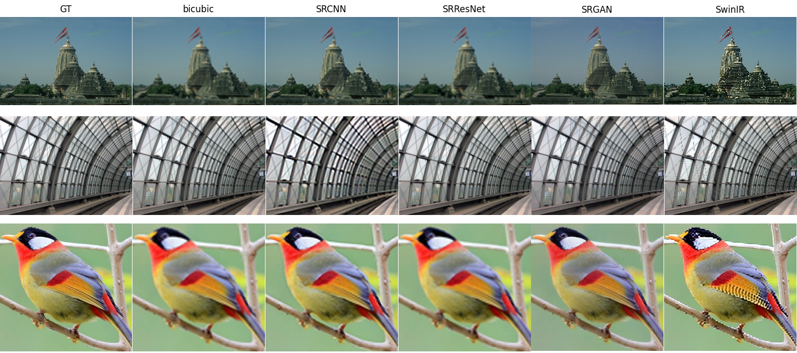
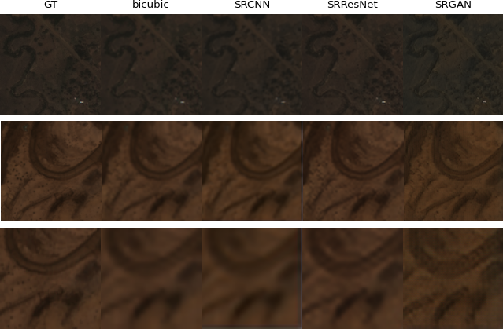
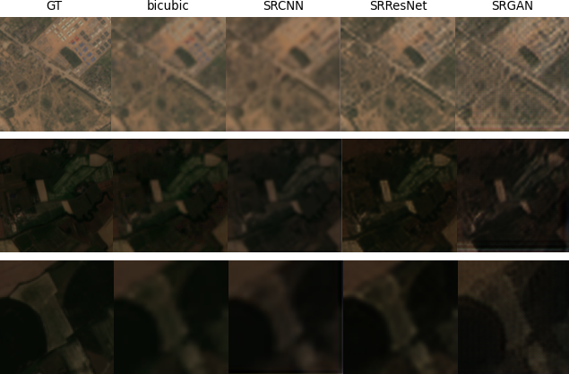

# TFG: Superresolució aplicada a imatge de satèl·lit usant xarxes neurnals

## Resum
Dins d'aquest projecte s'han evaluat els diferents models per la suepresolució d'imatges. S'ha utilitzat SRCNN, SRResNet, SRGAN i SwinIR per testejar la seva qualitat en diferents escenaris: imatges RGB, imatges satel·làries RGB i imatges satel·làries RGB-N.

## Estructura del Projecte

En [docs](docs) es troba el document amb tota la informació del projecte.

En [imgs](imgs) estan algunes de les imatges resultats pels diferents models i repositoris.

En [src](src) esta el codi de tot el projecte.

- [SRCNN](src/SRCNN/) conte tant el [model](src/SRCNN/model.py) com el [train](src/SRCNN/train_srcnn.py).
- [SRGAN](src/SRGAN/) conte tant el [model](src/SRGAN/models.py) com el [train_SRResNet](src/SRGAN/train_srresnet.py) i [train_SRGAN](src/SRGAN/train_srgan.py).
- [SwinIR](src/SwinIR/) en aquest directori es troben els fitxer necessaris per executar el SwinIR original. 
- [utils.py](src/utils.py) conte funcions imprescindibles pel funcionament dels models.
- [datasets.py](src/datasets.py) conte el DataLoader
- [create_data_list.py](src/create_data_list.py) i [create_data_list_sen&venus.py](src/create_data_list_sen&venus.py) són els fitxer prèvis que generen el json per tenir les rutes de les imatges que es vulguin utilitzar, tant pel test com pel train.
- [eval_rgb.py](src/eval_rgb.py) i [eval_sat.py](src/eval_sat.py) fan la evaluació quantitativa de les imatges amb el PSNR, SSIM, LPIPS, DISTS i CLIPIQA.
- [cuadricula_img.py](src/cuadricula_img.py) i [cuadricula_sat.py](src/cuadricula_sat.py) on es generen cuadricules de les imatges resultants.
- [downscale_images.py](src/downscale_images.py) baixa la qualitat de les imatges de un directori.

## Instal·lació

``` bash
git clone https://github.com/Itziar01/TFG-Superresoluci-d-imatges.git

pip install -r requirements.txt
```

## Ús

1. Generar `json` amb el path de les imatges (`create_data_list`)
2. Executar el train que es vol. Abans del de SRGAN s'ha de generar el model de SRResNet. La resta són independents. (`train_`).
3. Utilitzar l'eval per generar els resultats de les metriques (`eval`).

## Dades

- RGB
  - COCO 2014 https://cocodataset.org/#home
  - Urban100 https://www.kaggle.com/datasets/harshraone/urban100
  - Manga109 http://www.manga109.org/en/
  - T91 https://www.kaggle.com/datasets/ll01dm/t91-image-dataset
  - BSDS200 https://www.kaggle.com/datasets/ll01dm/t91-image-dataset
  - General100 https://www.kaggle.com/datasets/bluesky314/general100
  - set14 https://huggingface.co/datasets/eugenesiow/Set14
- Satèl·lit
  - WorldStrat https://worldstrat.github.io
  - Sen2Venus https://zenodo.org/records/6514159

## Resultats

### RGB


### RGB satèl·lit


### RGB-N satèl·lit


## Referencies

| Name                      | Tags           | Paper         | git              |
|---------------------------|----------------|---------------|------------------|
|Image Super-Resolution Using Deep Convolutional Networks                                               |cnn             |[Paper](https://arxiv.org/pdf/1501.00092.pdf)                                                             |[GitHub](https://github.com/Lornatang/SRCNN-PyTorch)  |
|SwinIR: Image Restoration Using Swin Transformer                                                       |cnn, tranformers|[Paper](https://arxiv.org/pdf/2108.10257v1.pdf)                                                           |[GitHub](https://github.com/JingyunLiang/SwinIR)    |
|Activating More Pixels in Image Super-Resolution Transformer                                           |cnn, tranformers|[Paper](https://arxiv.org/pdf/2205.04437v3.pdf)                                                           |[GitHub](https://github.com/XPixelGroup/HAT)        |
|ESRGAN: Enhanced Super-Resolution Generative Adversarial Networks                                      |gan             |[Paper](https://arxiv.org/pdf/1809.00219.pdf?)                                                            |[GitHub](https://github.com/leverxgroup/esrgan)     |
|Photo-Realistic Single Image Super-Resolution Using a Generative Adversarial Network                   |gan             |[Paper](https://arxiv.org/pdf/1609.04802.pdf)                                                             |                                                    |
|SRDiff: Single Image Super-Resolution with Diffusion Probabilistic Models                              |diffusion       |[Paper](https://arxiv.org/pdf/2104.14951.pdf)                                                             |[GitHub](https://github.com/LeiaLi/SRDiff/tree/main)|
|Improving the Stability of Diffusion Models for Content Consistent Super-Resolution                    |diffusion       |[Paper](https://arxiv.org/pdf/2401.00877.pdf)                                                             |[GitHub](https://github.com/csslc/CCSR)             |
|Single-image Super Resolution For Multispectral Remote Sensing Data Using Convolutional Neural Networks|cnn, satelite   |[Paper](https://isprs-archives.copernicus.org/articles/XLI-B3/883/2016/isprs-archives-XLI-B3-883-2016.pdf)|                                                    |
|Super-resolution of Sentinel-2 images: Learning a globally applicable deep neural network              |gan, satelite   |[Paper](https://arxiv.org/pdf/1803.04271.pdf)                                                             |                                                    |

